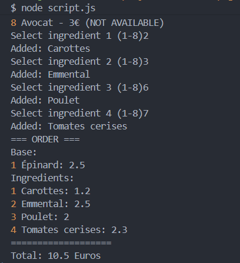
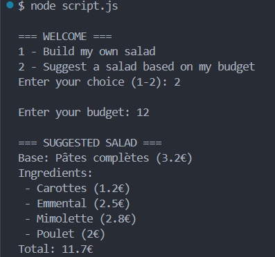
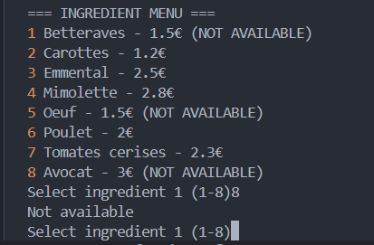
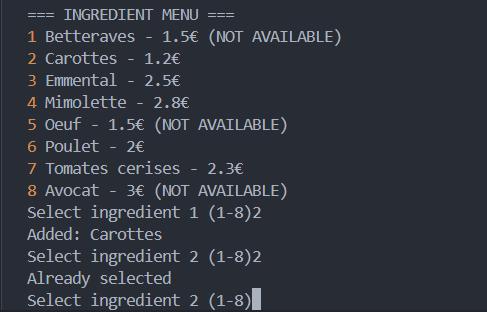
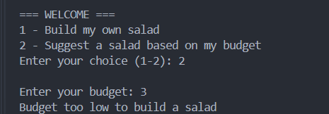
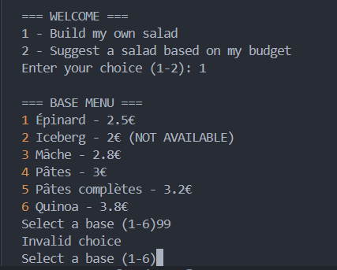

# 17 - Algorithmie

Fait entierement en ligne de commande

## Prérequis

Node.js 


## Lancer en ligne de commande

cd 17-Algorithmie

node script.js

---

## Les données

Au début du fichier, on a deux tableaux : `bases` et `ingredients`. Chaque élément a un nom, une catégorie, un prix, et un champ `available` qui indique si c'est disponible ou pas.

```js
{ name: 'Épinard', category: 'Salade', price: 2.5, available: true }
{ name: 'Avocat',  category: 'Fruit',  price: 3.0, available: false }
```

Les produits `available: false` s'affichent dans le menu mais le programme refuse de les sélectionner.

---

## Les fonctions

### `showBases()` et `showIngredients()`

Elles affichent simplement le menu dans le terminal. Une boucle `for` qui parcourt le tableau et affiche chaque ligne. Si un produit n'est pas dispo, on affiche `(NOT AVAILABLE)` à côté.

---

### `selectBase()`

Le client voit le menu et entre un numéro. La fonction tourne en boucle jusqu'à ce que le choix soit valide — c'est-à-dire que le numéro existe et que la base est disponible. Tant que c'est pas bon, on redemande.

---

### `selectIngredients()`

Même principe, mais on répète l'opération 4 fois. À chaque tour, on vérifie que l'ingrédient existe, qu'il est dispo, et qu'il n'a pas déjà été choisi (`.includes()` s'en occupe). La boucle s'arrête quand on a 4 ingrédients.

---

### `verifyIngredients(base, ingredients)`

C'est la vérification finale avant de calculer le prix. Elle s'assure que :
- il y a bien 1 base et 4 ingrédients
- tout est disponible
- il n'y a pas de doublon (double boucle qui compare chaque paire d'ingrédients)

Elle retourne `true` si tout va bien, `false` sinon.

---

### `calculatePrice(base, ingredients)`

Elle appelle `verifyIngredients()` d'abord. Si c'est bon, elle additionne les prix et affiche le total. Sinon elle affiche une erreur.

---

### `suggestSalad()`

Le client entre un budget. La fonction filtre les produits disponibles, les mélange aléatoirement (pour ne pas toujours suggérer la même chose), puis cherche une combinaison qui rentre dans le budget : elle prend une base, calcule ce qu'il reste, et essaie d'ajouter des ingrédients un par un jusqu'à en avoir 4. Si ça marche pas avec cette base, elle essaie la suivante.

---

### `main()`

C'est juste le point d'entrée. Elle affiche le menu d'accueil (choix 1 ou 2) et appelle les bonnes fonctions selon ce que le client choisit.

---

## Tests

###  Commande valide — composition manuelle

Épinard + Carottes + Emmental + Poulet + Tomates cerises

Total attendu : 2.5 + 1.2 + 2.5 + 2.0 + 2.3 = **10.5€**



---

###  Suggestion avec budget suffisant

Budget : 12€ → le programme propose une salade complète dont le total est ≤ 12€



---

###  Ingrédient indisponible

Essayer de choisir Avocat → `Not available`, le programme redemande



---

###  Ingrédient en double

Choisir Poulet deux fois → `Already selected`, ça ne s'ajoute pas



---

###  Budget trop faible

Budget : 3€ → `Budget too low to build a salad`



---

###  Numéro invalide

Entrer `99` comme numéro de base → `Invalid choice`, le programme redemande




### Recherche
Documentation: W3Schools
Readme: Markdown Guide


## Lien loom
https://www.loom.com/share/7c89e85680dc42be9657872452051d3f