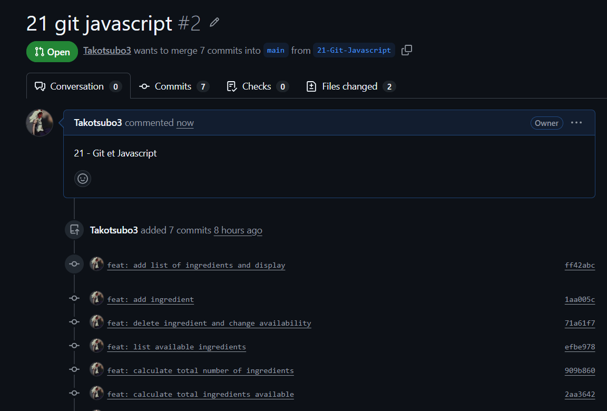
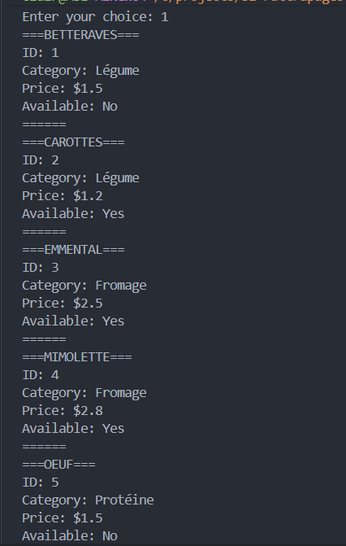
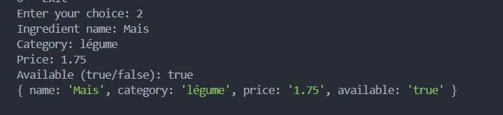
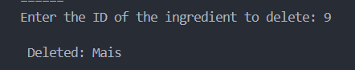
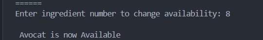
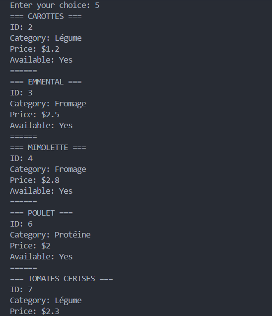
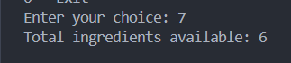

# 21 — Versionning avec Git & base de JavaScript 

Application réalisée entièrement en ligne de commande avec **Node.js**.

## Prérequis

* Node.js

## Lancer en ligne de commande

```bash
cd 18-Gestion-Ingredients
node script.js
```

---

## Fonctionnalités

L'application permet de :

* Afficher tous les ingrédients
* Ajouter un nouvel ingrédient
* Supprimer un ingrédient par son ID
* Modifier la disponibilité d'un ingrédient
* Afficher uniquement les ingrédients disponibles
* Afficher le nombre total d'ingrédients
* Afficher le nombre d'ingrédients disponibles

---

## Git

Le projet a été développé en utilisant **Git** avec une branche dédiée afin de ne pas travailler directement sur `main`.

### Workflow

1. Création d'une branche de développement à partir de `main`.
2. Développement de toutes les fonctionnalités sur cette branche.
3. Réalisation de commits réguliers avec des messages explicites.
4. Push de la branche sur le dépôt distant.
5. Création d'une **Pull Request** pour proposer la fusion avec `main`.
6. Après validation, fusion de la Pull Request dans la branche principale.

---

### Création de la branche

```bash
git checkout -b 21-Git-Javascript
```

---

### Historique des commits

Exemple de commits réalisés pendant le développement :

```bash
git commit -m "feat: add ingredient"
git commit -m "feat: delete ingredient and change availability"
git commit -m "feat: list available ingredients"

```

---

### Push de la branche

```bash
git push origin 21-Git-Javascript
```

---

### Pull Request

Une Pull Request est créée afin de demander la fusion de la branche de développement vers `main`.




---

### Merge dans `main`

Après validation, la Pull Request est fusionnée dans la branche `main`.


---

## Tests

### Affichage des ingrédients

Vérification que tous les ingrédients sont affichés avec leur ID, leur catégorie, leur prix et leur disponibilité.




---

### Ajout d'un ingrédient

Ajout d'un nouvel ingrédient avec des données valides.

**Capture d'écran :**



---

### Suppression d'un ingrédient

Suppression d'un ingrédient en sélectionnant son ID.

**Capture d'écran :**



---

### Changement de disponibilité

Modification de la disponibilité d'un ingrédient.



---

### Affichage des ingrédients disponibles

Vérification que seuls les ingrédients disponibles sont affichés.



---

### Statistiques

Affichage du nombre total d'ingrédients et du nombre d'ingrédients disponibles.



---

### Recherche

* Documentation : W3Schools/Stackoverflow
* README : Markdown Guide
